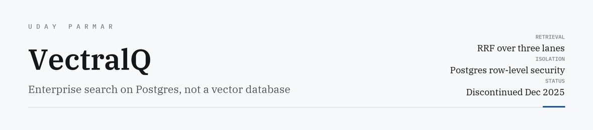
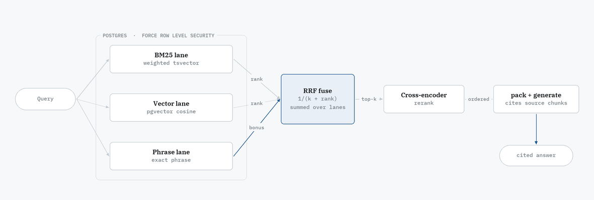

<picture>
  <source media="(prefers-color-scheme: dark)" srcset="assets/banner-dark.png">
  <source media="(prefers-color-scheme: light)" srcset="assets/banner-light.png">
  
</picture>

<p>
  
  
  
  
  
  <a href="https://uday-parmar.vercel.app/work/vectralq"></a>
</p>

Enterprise search that answers questions with citations. Multi-tenant, with retrieval that
fuses three lanes and reranks the result — all inside one Postgres instance.

Started August 2025, into **McGill TechAccel** within a month, piloted, and **discontinued in
December 2025** on weak demand. The retrieval worked; the market didn't. The code is here
because the engineering is still worth reading.

---

## How a query is answered

<picture>
  <source media="(prefers-color-scheme: dark)" srcset="assets/pipeline-dark.png">
  <source media="(prefers-color-scheme: light)" srcset="assets/pipeline-light.png">
  
</picture>

Every lane reads through row-level security, so the tenant boundary is crossed once, in the
database, rather than re-checked in each route.

## Why Postgres and not a vector database

Documents, chunks, embeddings, full-text indexes, tenancy and telemetry all live in one
instance. One backup story, one migration path, and transactional consistency between a
document and its vectors — they commit together, so they cannot drift apart.

## The three lanes

**Lexical** — Postgres full-text with `ts_rank_cd`. With `bm25_weighted` on it ranks against a
weighted tsvector (`text_tsv_enw`) that scores title and heading text above body text, so a
match in a heading outranks a match in a footnote.

**Semantic** — `pgvector` cosine distance (`<=>`), converted to similarity assuming
normalised embeddings.

**Phrase** — quoted or inferred phrases get their own lane contributing a *bonus into
fusion*, rather than being folded into the lexical score. An exact phrase hit is different
evidence from a bag-of-words hit, and is scored as such.

## Fusion

[Reciprocal Rank Fusion](https://dl.acm.org/doi/10.1145/1571941.1572114) by default:
`1/(k + rank)` summed across the lanes a candidate appears in, plus the phrase bonus. RRF
combines **ranks rather than scores**, so the lanes never need calibrating against each other
— which matters, because a BM25 score and a cosine similarity are not on comparable scales
and no amount of weighting makes them so.

A linear mode exists as a fallback, with min-max normalisation. One deliberate detail:
candidates missing from a lane are **not zero-filled** into the normalisation baseline.
Zero-filling makes each lane's floor depend on which documents happened to miss it, which
quietly distorts every other score in the set.

`test_search_fusion.py` covers the fusion step directly, because ranking bugs are silent —
nothing throws, the results are just slightly worse, forever.

## Tenancy

```sql
ALTER TABLE %I.%I FORCE ROW LEVEL SECURITY;
CREATE POLICY %I_isolate ON %I.%I
  USING      ((tenant_id)::text = current_setting('app.tenant_id', true))
  WITH CHECK ((tenant_id)::text = current_setting('app.tenant_id', true));
```

Isolation is enforced by the database, not by remembering a `WHERE` clause. Application-layer
filtering is one forgotten predicate away from a cross-tenant leak; with `FORCE RLS`, a query
that forgets the tenant returns **nothing** rather than someone else's documents. `WITH CHECK`
constrains writes the same way. The failure mode is an empty result, not a breach.

## Answering

Retrieved chunks pass through `context_packer`, which assembles the window and keeps the
mapping back to source chunks so answers can cite. Queries serve as a single response or over
**SSE** (`query_stream`), rendering token-by-token instead of after a wait.

A telemetry table records what each query actually did — lane counts, `fusion_mode` — because
"retrieval feels worse this week" is unfalsifiable without it.

## Running it

```bash
docker compose up -d db backend
```

Runs against a local model, so the whole stack works with no external API dependency and no
per-token cost:

```bash
ollama pull llama3.1:8b-instruct-q4_K_M   # then point LLM_BASE_URL at it
```

```bash
curl -X POST -H "X-Tenant-ID: $TENANT" -F file=@doc.pdf localhost:8000/api/docs/upload
curl -X POST -H "X-Tenant-ID: $TENANT"                  localhost:8000/api/embeddings/missing
curl -X POST -H "X-Tenant-ID: $TENANT" -H "Content-Type: application/json" \
     -d '{"question":"...","options":{"top_k":3}}'      localhost:8000/api/query/
```

`/api/search/debug` returns per-lane scores and ranks *before* fusion — the only practical way
to work out why a result placed where it did. Full setup notes in [`docs/SETUP.md`](docs/SETUP.md).

## What I would change

The cross-encoder is a stock checkpoint; one fine-tuned on the actual corpus would earn more
than any further tuning of fusion weights. Chunking is fixed-strategy and should adapt to
document structure.

And `rrf_k` was chosen by reading rather than by measurement. There is no evaluation set in
this repository, which is the real gap — without one, every claim above about retrieval
quality is an argument rather than a result.

---

<sub>Built by <a href="https://uday-parmar.vercel.app">Uday Parmar</a></sub>
